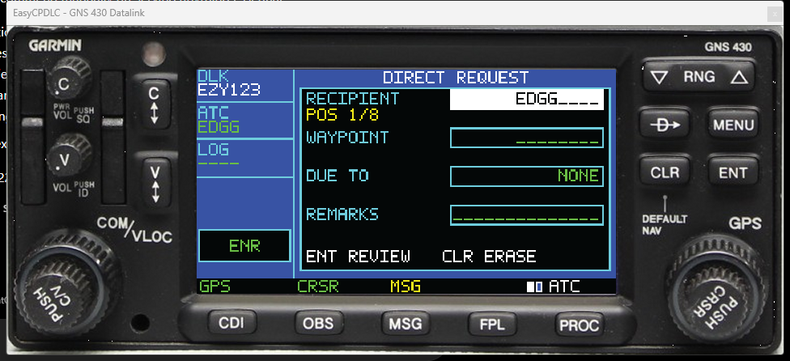

# EasyCPDLC GNS 430 panel

> **TESTING ONLY — NOT A SUPPORTED RELEASE.** This mod is an experimental simulator interface. Expect incomplete pages and integration changes while it is being tested.

This folder is an isolated front end for mixed-equipment home cockpits. It uses the existing `MainForm` connection, Hoppie/CPDLC session, message store, ATC request pages, AOC/telex pages, and settings. It does not copy or fork the network backend.

## Required Hoppie setup

Before connecting EasyCPDLC, set the aircraft's internal Hoppie/ATC network to **NONE** and remove or disable the Hoppie code stored in the aircraft. EasyCPDLC must be the only Hoppie client operating under the flight's callsign—even before the planned PMDG bridge is available.

Do not run EasyCPDLC and the aircraft's native Hoppie client together. Hoppie provides one pending-message queue for a station, not synchronized inboxes, so two pollers can divide messages unpredictably. EasyCPDLC remains the authoritative Hoppie inbox. The planned PMDG 737 adapter will mirror traffic from EasyCPDLC into the aircraft without creating another Hoppie connection.

The visual and interaction model follows the Garmin GNS 430 Pilot's Guide (190-00140-00 Rev. P), especially sections 1.2 and 1.3:

- Large right knob: change the `DLK`/`ATC`/`AOC`/`MSG` page group with the cursor off; move the cursor through fields or list items with it on.
- Small right knob: change the page within a group with the cursor off; change the selected value with it on.
- Push `CRSR`: enable or disable the cursor.
- `ENT`: accept or activate.
- `CLR`: erase, cancel, or return.
- `MSG`: message list.
- `FPL`: EasyCPDLC ATC request menu.
- `PROC`: EasyCPDLC AOC/telex menu.
- Direct-to: CPDLC direct-logon page.
- `RNG`: display text size.
- `CDI`: connect or disconnect VATSIM.

The page-group abbreviations describe this datalink adaptation rather than navigation functions: `DLK` contains status and the inbox, `ATC` contains logon and ATC requests, `AOC` contains company/weather/clearance/load functions, and `MSG` is the dedicated message shortcut group.

The LCD is rendered at the real unit's native `240x128` raster resolution and enlarged with nearest-neighbor scaling. It uses a purpose-built 5x7 bitmap alphabet instead of WinForms font rendering, plus the palette sampled from every display capture in the Pilot's Guide: `#3853A4` blue, `#040707` black, `#6ECDDD` cyan, `#69BD45` green, `#F3EC19` yellow, `#B9519F` magenta, and white. Fields, menus, inverse-video selections, scrollbars, page groups, page squares, and bottom annunciators are drawn using the same pixel-coordinate grammar as the guide.

The external panel is photographic artwork rather than a painted WinForms approximation. `Assets/panel-background.png` is a perspective-corrected front-panel crop, and `Assets/controls/` contains separate normal, pressed, range-rocker, pushed-knob, small-ring rotation, and large-ring rotation states. See `Assets/SOURCE.md` for source and personal-use provenance.

## Pilot Guide screen reference library

`scripts/Extract-Gns430ManualAssets.py` scans the complete Pilot's Guide and extracts every native `240x128` display image. The generated reference set under `output/gns430-reference/` contains:

- 479 UI image instances in every screen-sized resolution used by the guide, including 444 native `240x128` captures.
- A JSON and CSV page/caption manifest.
- The 64 most common exact display colors.
- Numbered contact sheets for visual comparison across every page, menu, popup, cursor state, and page group.

This reference set is design input and is not embedded into the application. The application recreates the screen grammar for EasyCPDLC data rather than displaying Garmin screenshots as operational pages.

## Opening it

Right-click the EasyCPDLC tray icon and choose **Open GNS 430 panel**. A shortcut may also start the normal executable with:

```text
EasyCPDLC.exe --gns430
```

Closing the panel hides it; the EasyCPDLC backend remains active in the tray.

## Screenshot and tutorial



The illustrated [GNS 430 datalink tutorial](Tutorial/README.md) covers shared credential setup, the page groups, mouse controls, dual-encoder behavior, ATC edit/review/send flow, messages, and MobiFlight operation.

## Shared credentials

Right-click the tray icon and choose **Connection credentials...** to edit the VATSIM CID, Hoppie logon code, SimBrief username or pilot ID, and eLoadControl API key without opening either display's setup pages. The dialog writes the same persistent settings used by the Airbus DCDU, Boeing DCDU, GNS 430, Hoppie, SimBrief, and eLoadControl workflows. Switching or hiding interfaces does not create a second account store. If a Hoppie session is already connected, reconnect before expecting a changed CID or logon code to take effect.

## Mouse interaction

Physical buttons use press-and-release behavior: hold the left mouse button to depress the photographed key, then release over the same key to activate it and return the artwork to normal. Dragging away before release cancels the action. Click and release the center of the right encoder for `PUSH CRSR`.

Use the mouse wheel over the right encoder to rotate it. Wheel up increases and wheel down decreases. The pointer position selects the ring: the center and middle ring operate the small inner knob, while the outer ring operates the large knob. Clicking the rings does not rotate them. The left COM/VLOC controls are deliberately not mapped to the GPS page knob, matching the separation of controls on the physical unit.

The panel accepts no keyboard navigation or keyboard shortcuts. Hardware input is handled by the private MSFS 2024 companion-module path described below.

## MSFS 2024 companion module

The simulator-facing path is a private standalone WASM companion, documented under [`MSFS2024Companion`](MSFS2024Companion/README.md). It does not impersonate a Garmin unit and never registers, receives, emits, or masks Garmin/GPS aircraft events.

The PMDG 737-800 cockpit attachment is built separately under
[`MSFS2024AircraftPackage`](MSFS2024AircraftPackage/README.md). It mounts the
simulator's stock GNS430 model and buttons over the empty printer-panel DZU
opening, then replaces only the LCD with EasyCPDLC's 240×128 display.

MobiFlight writes command numbers to `L:EASYCPDLC_GNS_COMMAND`. The companion validates the value, clears it, and passes a checksummed command packet through named SimConnect Client Data. EasyCPDLC returns module status, VATSIM connection state, unread count, current page, and cursor state for MobiFlight output devices.

Use **MSFS MODULE** in the panel menu. `WAITING` means SimConnect is open but the standalone module heartbeat has not arrived; `ACTIVE` means the complete module path is working. Ready-made MobiFlight 11 projects are provided for the [GNS 430 controls](MSFS2024Companion/MobiFlight/EasyCPDLC-GNS430-Companion.mfproj) and [DCDU LSK/buttons](MSFS2024Companion/MobiFlight/EasyCPDLC-DCDU-Companion.mfproj).

For users who prefer a physical Airbus/Boeing DCDU, the tray option **Use MSFS companion for DCDU controls** switches the private module to DCDU mode. Only in that mode does it accept the twelve `EASYCPDLC_DCDU_LSK_*` and eight `EASYCPDLC_DCDU_*` button L-vars. The generic GNS command variable is ignored until DCDU mode is disabled. The selection is persistent and reconnects automatically when MSFS/SimConnect becomes available.

## Native datalink workflows

Message browsing, CPDLC replies, VATSIM connect/disconnect, direct logon, complex ATC requests, AOC/telex, METAR, ATIS with optional auto-refresh, pre-departure clearance, oceanic clearance, and eLoadControl are native GNS pages. The rotary editors validate and display a review page before sending through the existing EasyCPDLC backend. They do not open the legacy DCDU request pages.

For eLoadControl, save the SimBrief user and eLoadControl API key in the normal EasyCPDLC setup once. The GNS `AOC` group then loads the OFP and reference data, permits aircraft/cabin/format and passenger-split adjustment, reviews the request, generates the loadsheet, and delivers the result as a normal unread `LOADSHEET` message.

The normal rendered LCD annunciator row mirrors the physical controls without placing anything over the panel photograph: `GPS` is positioned over CDI, `CRSR` over OBS while the cursor is active, and amber `MSG` over the MSG key while unread inbound traffic exists. Pressing MSG opens an unread message first and marks it read when it is displayed; when no unread message remains, it opens the complete message list.

General EasyCPDLC settings still open the existing setup page because account credentials and application-wide preferences are shared with the main program.

## Next integration step

The companion protocol is intentionally aircraft-independent. Do not add aircraft-specific GNS events to it; extend the versioned `EasyCPDLC.GNS430.*` client-data protocol or private `EASYCPDLC_GNS_*` L-vars instead.

The first planned aircraft-inbox adapter is the **PMDG 737 for MSFS 2024**. It is not implemented in this testing branch: a supported PMDG datalink message-ingress interface must first be confirmed on the SDK-equipped machine. See [`docs/HOPPIE-AIRCRAFT-ACARS-ROUTING.md`](../../docs/HOPPIE-AIRCRAFT-ACARS-ROUTING.md) for the implementation and validation plan.

This panel is for simulator use only and is not approved for real-world navigation.
