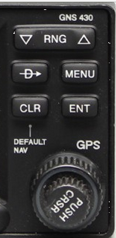
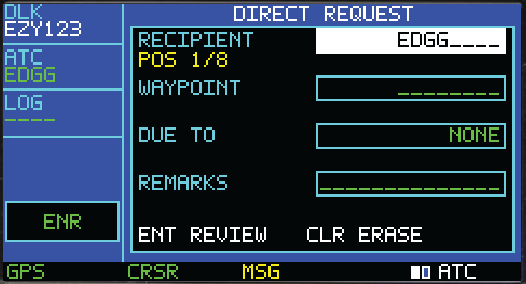

# VNS430 virtual datalink instrument

VNS430 is the optional virtual instrument shipped beneath EasyCPDLC
Print + eLoadControl. VNS430 is the name used for every EasyCPDLC-owned type,
protocol, and L-var; `GNS430` appears only where it refers to the stock
Microsoft Flight Simulator model that supplies the 3D artwork.

VNS430 is a front end only. It shares the Print/eLC application's Hoppie
connection, CPDLC session, message store, ATC/AOC workflows, SimBrief data,
eLoadControl integration, and saved credentials. It does not create a second
network backend.


## Required Hoppie setup

Before connecting EasyCPDLC, set the aircraft's internal Hoppie/ATC network to
**NONE** and remove or disable its Hoppie code. EasyCPDLC must be the only
Hoppie client polling under the flight's callsign. Two clients can divide
pending messages unpredictably.

## Open the desktop instrument

Right-click the EasyCPDLC tray icon and choose **Open VNS430 panel**, or start:

```text
EasyCPDLC.exe --vns430
```

Closing the panel hides it while the shared backend remains active.

## Page groups and controls

The LCD keeps the familiar GNS-style interaction grammar while assigning the
groups to datalink work:

- `DLK`: connection and status.
- `ATC`: logon and ATC requests.
- `AOC`: telex, weather, clearance, and load control.
- `MSG`: inbox and message detail.

The 240×128 LCD uses a bitmap alphabet, inverse selections, page squares,
scrollbars, annunciators, and the blue/cyan/green/yellow/magenta palette
derived from the Garmin GNS 430 Pilot's Guide. The application recreates the
design language for EasyCPDLC data; it does not display copied Garmin screens.

### What each key does

The key legends are stock GNS 430 nomenclature and do not describe the datalink
action behind them. Every key drives one action and one
`L:EASYCPDLC_VNS_COMMAND` value, and values 6 to 18 are each claimed exactly
once; 1 to 5 belong to the encoder rings and the cursor push.

| Key | Action | L-var |
|---|---|---|
| `COM` | Show or hide the panel | 18 |
| `VLOC` | Message log, every message | 17 |
| `CDI` | Connect or disconnect VATSIM | 14 |
| `OBS` | Toggle the cursor | 13 |
| `MSG` | Messages, unread first | 9 |
| `FPL` | ATC request menu | 10 |
| `PROC` | AOC / telex menu | 11 |
| `D→` | Hoppie logon page | 12 |
| `RNG −` / `RNG +` | Smaller / larger LCD text | 16 / 15 |
| `MENU` | Menu overlay | 8 |
| `CLR` | Back or clear | 7 |
| `ENT` | Activate the selection | 6 |
| Large ring | Move the selection, or change page group | 1 / 2 |
| Small ring | Change page within the group | 3 / 4 |
| Ring push | Toggle the cursor | 5 |

`COM` and `VLOC` previously repeated `CDI` and `MSG`, which left four keys
driving two actions while two commands had no key at all.

Mouse operation:

- Hold the left mouse button on a photographed key and release over the same
  key to activate it. Dragging away cancels the press.
- Use the wheel over the center or middle ring of the right encoder for the
  small knob.
- Use the wheel over its outer ring for the large knob.
- Click and release the encoder center to push `CRSR`.
- With the cursor off, the large knob changes group and the small knob changes
  page.
- With the cursor on, the large knob selects a field and the small knob edits
  its value.



The panel intentionally has no keyboard navigation. `FPL` opens ATC requests,
`PROC` opens AOC/telex, `MSG` opens unread traffic first, `CDI` controls the
VATSIM connection, `ENT` accepts, and `CLR` erases or returns.

## Edit, review, and send

ATC direct, level, speed, when-can-we and free-text requests, AOC telex,
METAR, ATIS, PDC, oceanic clearance, and eLoadControl all use native VNS430
pages. Fields are edited with the dual encoder, validated, reviewed, and only
then passed to the existing backend.



For eLoadControl, save the SimBrief user and eLoadControl API key once through
the tray's **Connection credentials...** dialog. The same values remain
available when switching among Airbus DCDU, Boeing DCDU, and VNS430.

## Messages

Amber `MSG` inside the LCD means unread inbound traffic. Pressing `MSG` opens
an unread message first and marks it read when displayed; otherwise it opens
the complete list. Select a response with the small knob and press `ENT` to
send it through the shared backend.

## Optional MSFS 2024 module

[`MSFS2024Module`](MSFS2024Module/README.md) contains:

- the optional PMDG 737-800 in-simulator 3D installation;
- the standalone WASM bridge;
- the VNS430 and DCDU MobiFlight profiles;
- package build and validation tools.

The 3D installation uses the simulator's stock GNS430 mesh as physical artwork
and replaces only its LCD with VNS430. It does not turn VNS430 into a Garmin
navigation unit. The package is optional and is known not to load reliably in
every aircraft/session; the desktop instrument remains the supported fallback.

## Artwork and source references

`Assets/` contains the desktop panel photograph and independent pressed/rotated
control states. [Assets/SOURCE.md](Assets/SOURCE.md) records the source and
personal-use provenance. The manual-extraction and sprite-building scripts are
maintained developer tools and do not ship generated reference contact sheets.

VNS430 is for flight simulation only and is not approved for real-world
navigation or communications.
