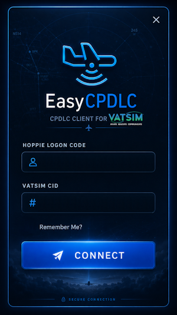
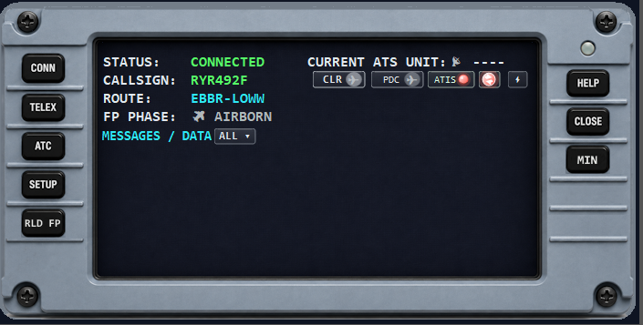
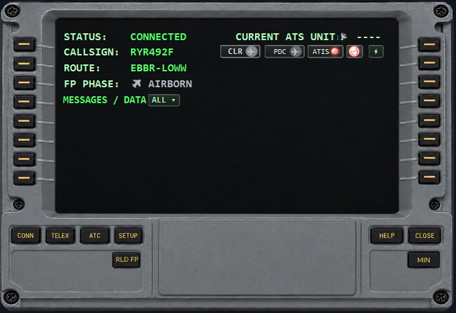

# EasyCPDLC Print + eLoadControl


This repository is the focused **EasyCPDLC-Print-eLC** development line. Its
upstream is [EasyCPDLC-Modernized](https://github.com/fresH229a/EasyCPDLC-Modernized),
whose README is preserved in [README.UPSTREAM.md](README.UPSTREAM.md).

The Print/eLC application remains deliberately limited to cockpit printing,
eLoadControl, display/artwork controls for extra screens, and the integrations
required by those workflows.

> **Hoppie warning:** before connecting EasyCPDLC, set the aircraft's internal Hoppie/ATC network to **NONE** and remove or disable its Hoppie code. EasyCPDLC must be the only Hoppie client using the flight's callsign. Running the aircraft and EasyCPDLC as simultaneous Hoppie clients can divide pending messages unpredictably between them.

The fork adds review-first cockpit printing, direct eLoadControl loadsheet
requests, and an optional vPilot bridge for vTDLS PDCs and ATC Contact Me
alerts while retaining the upstream CPDLC client and Airbus/Boeing DCDUs.

> **Flight simulation only.** This project is not approved for real-world aviation, dispatch, communications, loading, or other safety-critical use.

## What this fork is for

The scope of this fork is intentionally narrow:

- print the datalink item currently open on either DCDU
- support ordinary Windows printer queues and raw ESC/POS receipt printers
- default to the generic 4-inch / 104 mm printable-width profile used by printers such as the Citizen CT-S4000
- retain an 80 mm / 72 mm profile for devices such as the Rongta RP326
- request an eLoadControl textual loadsheet inside EasyCPDLC using the pilot’s own API key
- let the pilot review a loadsheet or imported clearance before printing it
- optionally import vPilot/vTDLS PDC messages and controller Contact Me alerts through a local bridge
- suppress duplicate automatic prints and duplicate bridge imports
- preserve upstream Hoppie CPDLC, PDC/DCL discovery, and click-only `REQ CLR` behavior

This fork is **not** intended to:

- replace eLoadControl’s website, PDF documents, or weight-and-balance engine
- turn vTDLS PDC into Hoppie CPDLC or invent a `KUSA` logon
- scrape controller systems or import all vPilot private chat
- write directly to a USB device or assume a USB printer creates a COM port
- redesign unrelated EasyCPDLC behavior

## Added workflows

### Display and hardware-panel mode

Open `SETUP > DISPLAY` from either DCDU to configure the main window:

- `PANEL ARTWORK` shows the normal Airbus or Boeing bezel; turning it off produces a compact screen-only window.
- `ONSCREEN KEYS` enables the painted panel and LSK click hotspots. Turn it off when physical controls will operate the client.
- `WINDOW SCALE` selects common sizes from 75% through 200%. The lower-right corner can also be dragged to choose a proportional size in 5% steps.
- `RESET SIZE` returns the current artwork or screen-only window to 100%.

Drag the top of the window to move it. Artwork, key, and scale choices persist for the current Windows user. The system-tray menu includes the same artwork/key toggles and an `Open Display Settings` recovery action, so disabling on-screen keys cannot lock the user out of the setting.

### DCDU printing

The printer integration is isolated behind a small printer service and offers three modes:

- **ESC/POS** sends raw bytes through the selected Windows printer queue using the Windows spooler. This is the preferred mode for the Citizen CT-S4000 and Rongta RP326 profiles.
- **Windows** sends a Windows-rendered print document through the selected queue.
- **Mock file** writes the ESC/POS binary, text preview, and hexadecimal dump without opening a printer or consuming paper.

Printer settings include:

- installed Windows printer selection with persistent storage
- persisted paper-profile selection
- generic 4-inch profile with 69-column Font A or 92-column Font B formatting
- generic 80 mm profile with 48-column Font A or 64-column Font B formatting
- manual `PRINT` and `REPRINT`
- optional automatic printing by message category
- configurable feed lines
- partial cut, full cut, or cutter disabled
- test print and queue-status refresh

The default Citizen CT-S4000 sequence is:

```text
ESC @       initialize
ESC a 0     left alignment
ESC t 0     CP437 code page
ESC M 0/1   Font A (69 columns) or Font B (92 columns)
...         formatted message
ESC d 3     feed three lines
GS V 66 0   partial cut
```

The formatted sheet uses full-width separator rules and right-aligned type/timestamp and aircraft/sender metadata when space permits. Intentional message line breaks and monospaced alignment are preserved, and long lines wrap at word boundaries where practical.

The selected printer must exist. EasyCPDLC fails closed instead of silently sending a job to the Windows default queue. The RP326 sample job and complete hexadecimal stream remain in [docs/samples/rp326-ci7752-job.hex.txt](docs/samples/rp326-ci7752-job.hex.txt).

#### Printer-profile tutorial

Printer profiles describe the paper and printable width; they do not replace the Windows printer-queue selection. Select both the installed queue and the matching profile.

| Profile | Paper / printable width | Normal mode | Condensed mode | Recommended use |
|---|---:|---:|---:|---|
| `GENERIC 4 INCH` | 4-inch class / 104 mm printable | Font A, 69 columns | Font B, 92 columns | Default; suitable for the Citizen CT-S4000 and other wide airline-style receipt printers |
| `GENERIC 80MM` | 80 mm / 72 mm | Font A, 48 columns | Font B, 64 columns | Rongta RP326 and compatible 80 mm ESC/POS printers |

To configure a printer from either DCDU:

1. Open `SETUP`, then select `PRINTER`.
2. Open `DEVICE / MODE`, select the exact Windows queue, and choose `ESC/POS`. Use `MOCK FILE` first if you do not want to consume paper.
3. Return to `PRINTER`, open `FORMAT / CUT`, and select the matching paper profile.
4. Leave the default normal Font A mode for loadsheets and ordinary ACARS messages. Select condensed Font B only when a long operational message benefits from additional columns.
5. Set `FEED LINES` to `3` and `AUTO CUT` to `PARTIAL`. Use `FULL` or `OFF` only when required by another printer's cutter.
6. Return to the printer menu and select `PRINT TEST`. Confirm that the heading is centered, separator rules reach nearly across the printable area, aligned values remain monospaced, three blank lines feed, and the cutter operates.
7. Open a received DCDU item and use its `PRINT` action. `REPRINT` prints the most recently completed item again.

The selected profile and column mode are saved for the current Windows user. Existing installations without a saved profile migrate to `GENERIC 4 INCH` and its 69-column normal mode.

### eLoadControl loadsheets

Open `AOC/TELEX > LOADSHEET` to use the direct eLoadControl workflow:

1. Enter your eLoadControl API key and SimBrief user identifier.
2. Load the latest SimBrief data and available eLoadControl configurations.
3. Select the aircraft variant, cabin configuration, and output format.
4. Review and confirm the passenger split. Single-class configurations are prefilled; multi-class splits remain editable.
5. Confirm generation. This consumes one eLoadControl API request.
6. Review the returned textual ACARS loadsheet on the DCDU.
7. Print the item currently displayed when ready.

The API key uses the eLoadControl bring-your-own-key model. If saved, it is protected for the current Windows user with Windows DPAPI. It is not committed to this repository or written to application logs.

Direct API loadsheets are review-first and do not auto-print. The client prints eLoadControl’s textual ACARS message, not a scaled full-page PDF.

### vPilot / vTDLS and ATC Contact Me bridge

The optional `EasyCPDLC.VPilotBridge` uses vPilot’s plugin API and a current-user local named pipe:

```text
vTDLS/controller → VATSIM private message → vPilot plugin
                 → local named pipe → EasyCPDLC review/print screen
```

The bridge imports only supported clearance/PDC traffic and controller-originated Contact Me requests; unrelated private chat stays in vPilot. Contact requests appear under `VPILOT MSGS` with the controller callsign, a readable facility label such as `SFO APPROACH` or `OAK CENTER`, the radio frequency, and the original instruction. Both message types are checked against the EasyCPDLC callsign where possible and deduplicated so reconnect resends do not create another displayed or printed copy.

Contact Me alerts are review-first. Open `VPILOT MSGS`, select the alert, and use the DCDU `PRINT` action if a paper copy is wanted. They do not use Hoppie, do not create a CPDLC session, and do not alter the PDC-availability badge.

Imported PDCs do not provide a Hoppie logon code, do not turn the airport PDC-availability badge green, do not enable `REQ CLR`, and do not gain CPDLC reply actions such as `WILCO`.

The normal release ZIP includes a compiled bridge and an optional installer. Close vPilot, extract the complete ZIP, and double-click:

```text
Install-vPilot-Bridge.cmd
```

Release users do not need the .NET SDK to install the bridge. The installer verifies and copies the bundled `Bridge\EasyCPDLC.VPilotBridge.dll` into the current user's vPilot `Plugins` folder.

From a source checkout, developers can instead run:

```powershell
powershell -ExecutionPolicy Bypass -File .\scripts\Install-VPilotBridge.ps1
```

Restart vPilot and use `.debug` to confirm that `EasyCPDLC vPilot Bridge` is loaded.

## Preserved upstream behavior

The new modules do not replace the existing clearance workflow. In particular, the upstream PDC badge still checks airport/controller information and Hoppie station availability. `REQ CLR` remains click-only and is only offered when PDC/DCL availability is confirmed.

The following upstream features remain in place:

- Hoppie ACARS and CPDLC communication
- Airbus- and Boeing-style DCDU layouts
- PDC/DCL availability and logon-code discovery
- flight-plan reload and VATSIM callsign protection
- ATIS/METAR actions and message filtering
- SimBrief navlog support
- Flow Pro URI and system-tray integration

See [README.UPSTREAM.md](README.UPSTREAM.md) for the full upstream documentation.

## Screenshots

| Login | Airbus DCDU | Boeing DCDU |
|---|---|---|
|  |  |  |

## Requirements

- Windows 11 x64
- .NET 10 SDK to build from source
- VATSIM CID and Hoppie ACARS logon code for normal EasyCPDLC use
- optional SimBrief account/user identifier
- optional eLoadControl account and API key for direct loadsheet generation
- optional vPilot installation for the vTDLS bridge
- optional Windows-installed receipt printer for physical printing

The application is published as a self-contained Windows x64 executable. Raw receipt printing uses the standard Windows spooler; no Rongta SDK, OPOS runtime, serial-port library, npm package, or Python package is required.

## Build and test

From a PowerShell prompt with the .NET 10 SDK:

```powershell
dotnet restore .\EasyCPDLC.sln
dotnet build .\EasyCPDLC.sln -c Release
dotnet test .\EasyCPDLC.Tests\EasyCPDLC.Tests.csproj -c Release
```

To publish the main client:

```powershell
dotnet publish .\EasyCPDLC\EasyCPDLC.csproj -c Release
```

To produce the complete release ZIP with the compiled optional vPilot bridge and installer:

```powershell
powershell -ExecutionPolicy Bypass -File .\scripts\Build-Release.ps1 -Version 1.1.0
```

Fork releases use namespaced SemVer tags such as `printer-elc-v1.1.0`; they do not reuse upstream EasyCPDLC tag names. See [VERSIONING.md](VERSIONING.md).

Use **Mock file** mode and **Test Print** before submitting jobs to a physical printer.

## Citizen CT-S4000 quick start (default)

1. Install Citizen's current CT-S4000 Windows 11 driver.
2. Connect the printer by USB and confirm Windows creates a normal printer queue.
3. Load 112 mm outward-wound thermal receipt paper and print the printer self-test.
4. In EasyCPDLC, open `SETUP > PRINTER`, select the queue, and choose `FORMAT / CUT`.
5. Select `GENERIC 4 INCH`, `FONT A / 69`, `3` feed lines, and `PARTIAL` cut.
6. Run a mock-file test before sending the first physical test print.

The 92-column Font B option is available for dense operational messages. Font A / 69 is the default because it is easier to read and uses almost the full 832-dot printable line.

## RP326 / generic 80 mm quick start

1. Install the current Windows x64 driver for the RP326.
2. Confirm Windows creates a normal printer queue, commonly named `Rongta RP326`.
3. Print a Windows test page and verify that the queue is online and not paused.
4. In EasyCPDLC, open `SETUP > PRINTER` and select the exact queue.
5. Select `GENERIC 80MM`, `FONT A / 48`, `3` feed lines, and `PARTIAL` cut.
6. Run a mock-file test, inspect the preview, then run a physical test print.

Physical hardware is still required to validate the installed driver’s RAW pass-through, firmware code-page mapping, status reporting, print darkness/spacing, and cutter response.

## Security and privacy

- Do not commit Hoppie codes, eLoadControl API keys, VATSIM credentials, or other secrets.
- Saved eLoadControl keys are protected with Windows DPAPI for the current Windows account.
- Printer logs record job outcomes and useful errors without logging message bodies or credentials.
- The vPilot bridge accepts local connections for the current Windows user rather than exposing a network service.

If a key has ever been posted publicly, revoke it with the service provider and issue a new one.

## Project status

This is a community testing fork. The printer byte stream, mock output, formatter, encoding, duplicate suppression, and bridge protocol can be tested automatically. A physical Citizen CT-S4000 or RP326 plus live controller-issued vTDLS PDC and Contact Me messages are still needed for final end-to-end validation.

Issues and pull requests should stay within the limited scope described above. General EasyCPDLC modernization work belongs upstream unless it is required for these integrations.

## Credits and upstream

- Fork-specific repository: [Weebpummling/EasyCPDLC-Modernized-Printer-eLC](https://github.com/Weebpummling/EasyCPDLC-Modernized-Printer-eLC)
- Immediate upstream: [fresH229a/EasyCPDLC-Modernized](https://github.com/fresH229a/EasyCPDLC-Modernized)
- Original project: [quassbutreally/EasyCPDLC](https://github.com/quassbutreally/EasyCPDLC)
- Original EasyCPDLC copyright © 2022 Joshua Seagrave

Thanks to the EasyCPDLC, Hoppie, VATSIM, SimBrief, eLoadControl, and flight-simulation communities.

## License and disclaimer

This project is licensed under the GNU General Public License v3.0 or later, consistent with the upstream project.

This unofficial community fork is not affiliated with or endorsed by VATSIM, Hoppie, eLoadControl, SimBrief, PMDG, Rongta, aircraft manufacturers, aviation authorities, or the original EasyCPDLC authors. It is provided as-is, without warranty. Use it only for flight simulation and at your own risk.
